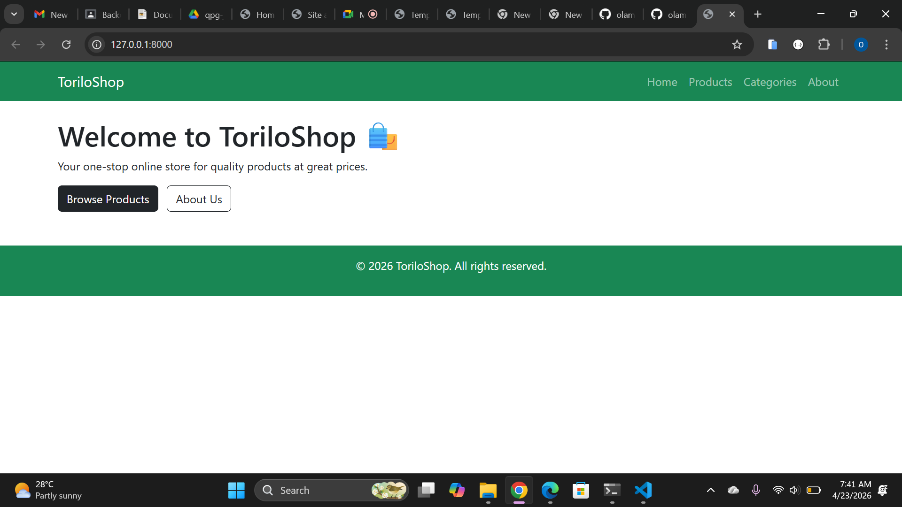
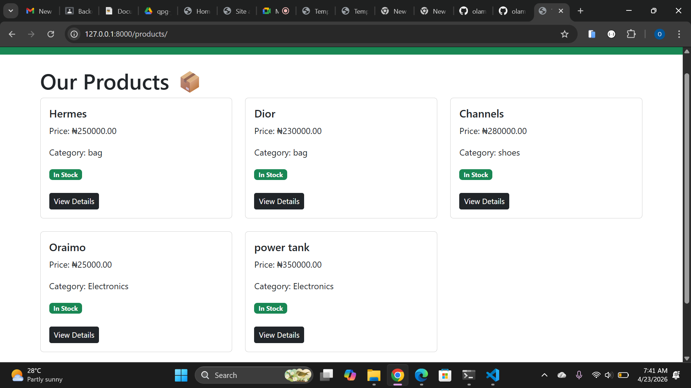
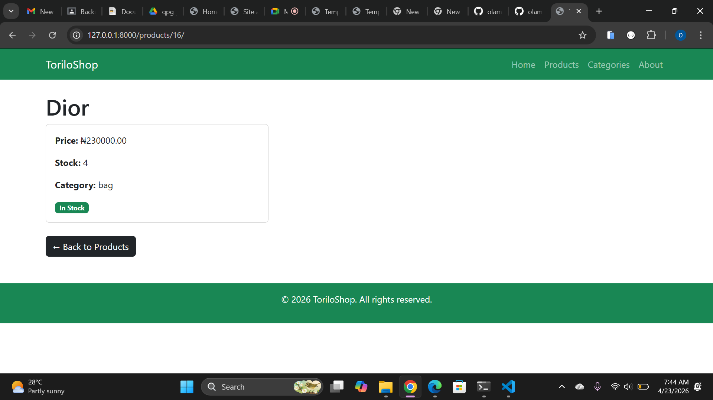
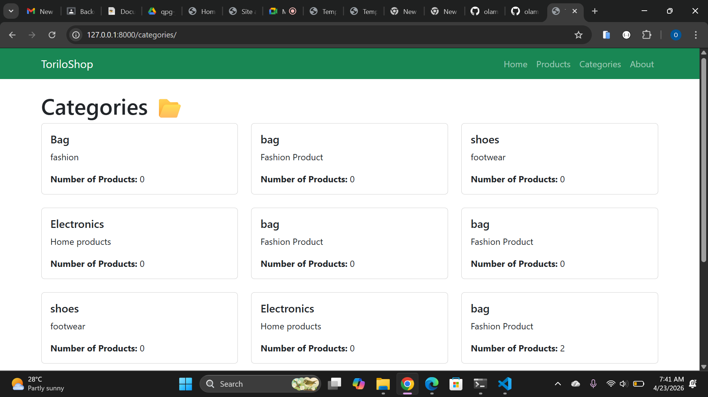
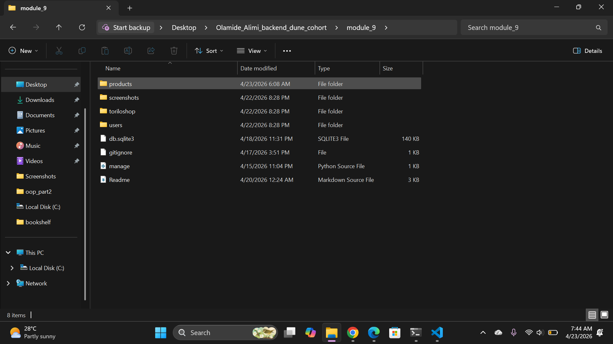

# ToriloShop - Django Project

## Project Description

ToriloShop is a Django-based online shop built as part of the Backend Dune Cohort.
Module 9 adds full product listing pages with templates, Bootstrap styling,
and Django Template Language (DTL).

## Features Implemented

### Views and URLs

- **home()** → `/` — Welcome page for the shop
- **product_list()** → `/products/` — Lists all products with stock badges
- **product_detail()** → `/products/<id>/` — Shows one product's details
- **category_list()** → `/categories/` — Shows all categories and product counts
- **about()** → `/about/` — About page

### Templates

- **base.html** — Base template with navbar and footer
- **home.html** — Home page extending base.html
- **product_list.html** — Product listing with for loop and if/else badges
- **product_detail.html** — Single product detail page
- **category_list.html** — Category listing with product counts

## Setup Instructions

1. Clone the repository:
   git clone https://github.com/olamide-15/olamide-alimi-backend-dune-cohort.git
2. Navigate into the module-9 folder:
   cd-alimi-backend-dune-cohort/module-9
3. Create a virtual environment:
   python -m venv venv
4. Activate it:
   venv\Scripts\activate
5. Install dependencies:
   pip install django
6. Run migrations:
   python manage.py migrate
7. Create a superuser:
   python manage.py createsuperuser
8. Run the server:
   python manage.py runserver
9. Open browser at `http://127.0.0.1:8000/`

## Screenshots

