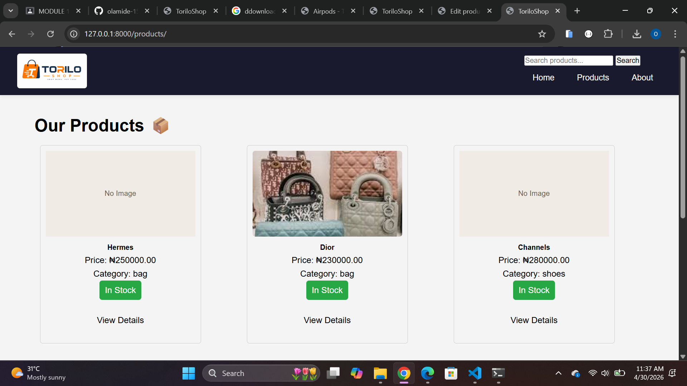
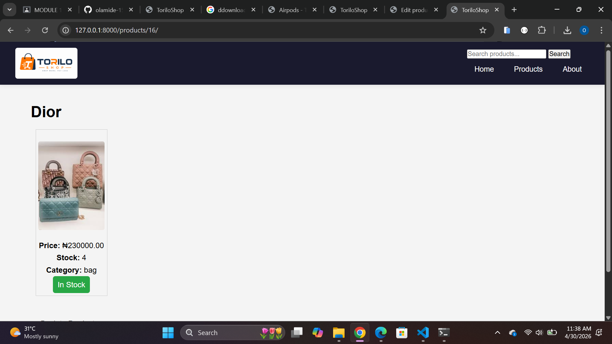
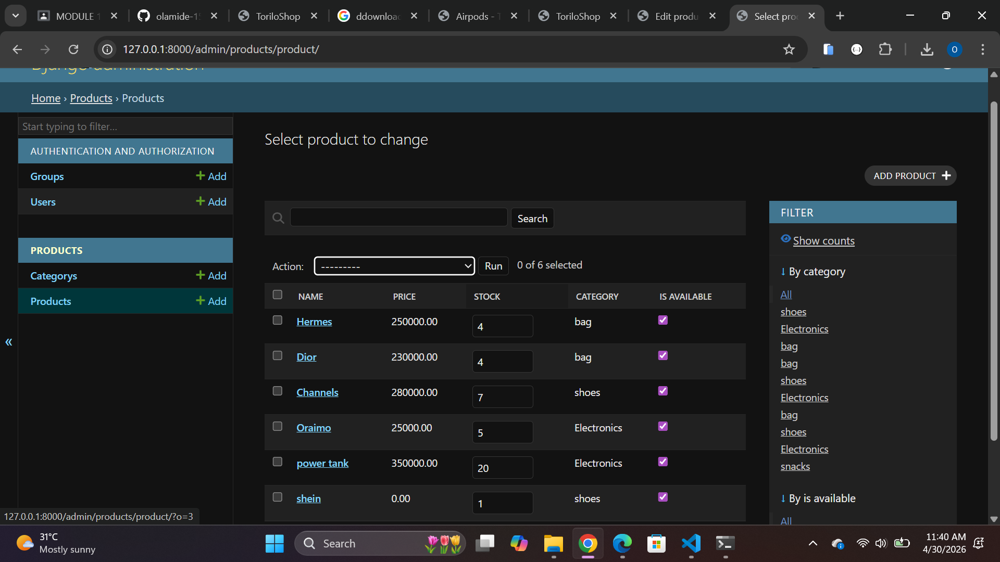
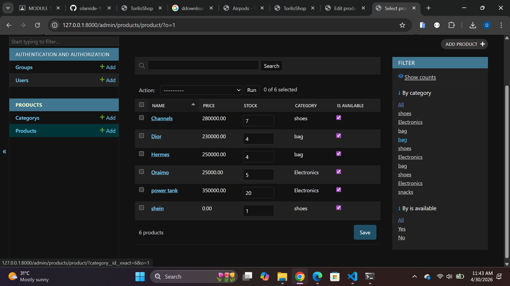

# ToriloShop - Django Project

## Project Description

Visual changes in toriloshop 
-Added product.css, home.css,  with clean, modern product page styling

## Features Implemented

- Static Files – Created static/ folder and     configured products.css for custom page styling
- ImageField – Installed Pillow to support product image uploads
- Admin Customization – Configured Django admin panel for product management
- Bulk Actions – Added bulk action support in the admin panel

## Setup Instructions

1. Clone the repository:
   git clone https://github.com/olamide-15/olamide-alimi-backend-dune-cohort.git
2. Navigate into the module-9 folder:
   cd-alimi-backend-dune-cohort/module-9
3. Create a virtual environment:
   python -m venv venv
4. Activate it:
   venv\Scripts\activate
5. Install dependencies:
   pip install django
6. Added a static url in settings.py
7. added  to the base.html to link with a static path
8. To collectstatic with py manage.py collectstatic
9.  in settings.py added the media url/root 
10.  then a pillow was installed into the exisiting virtual enviroment
11. an imagefiled was added to product in model.py
   n product.url.py
to customize  product.admin.py 
13. Run migrations:
   python manage.py migrate
14. Create a superuser:
   python manage.py createsuperuser
15. Run the server:
   python manage.py runserver
16. Open browser at `http://127.0.0.1:8000/`

## Screenshots

