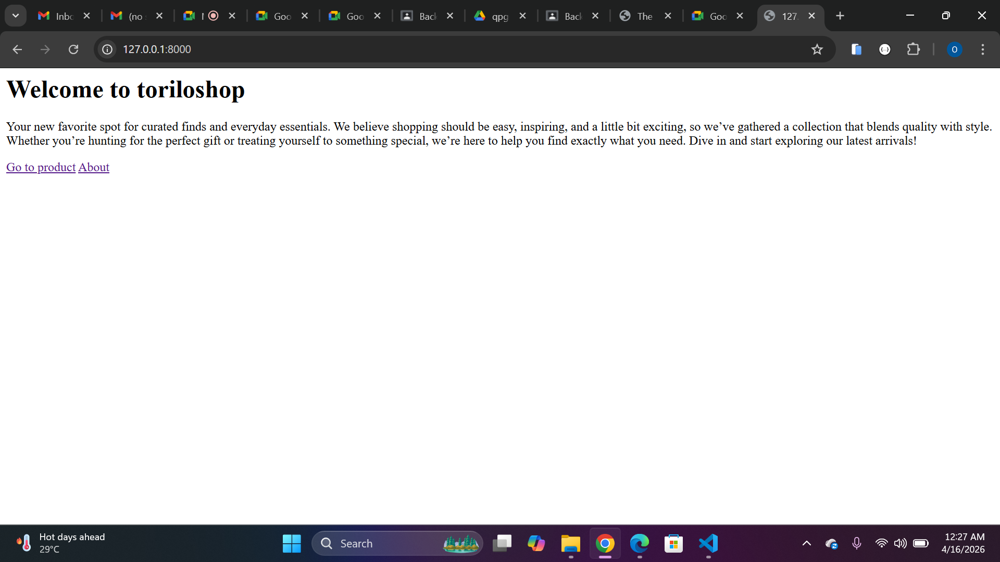
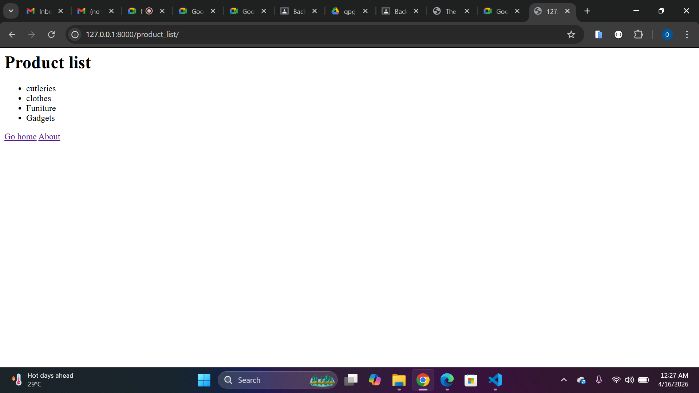
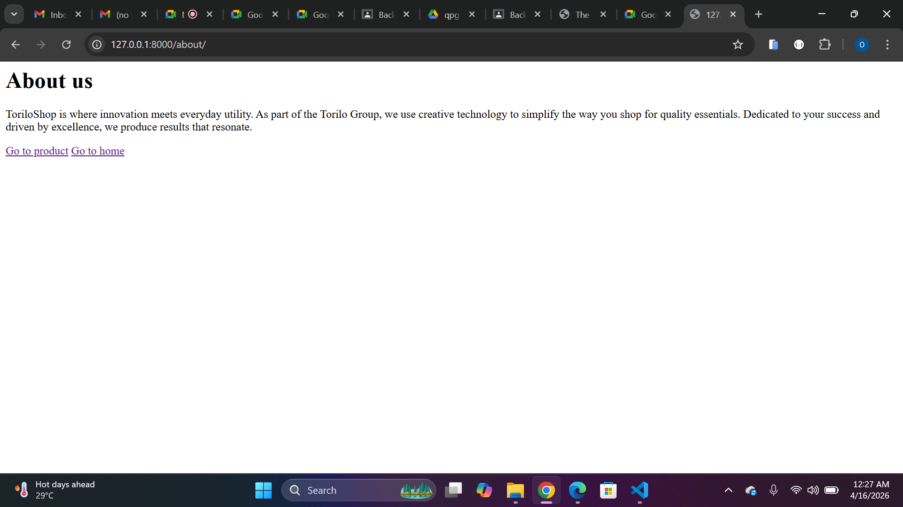
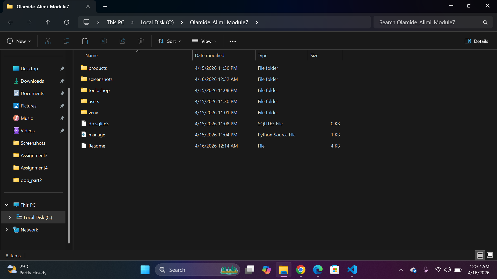
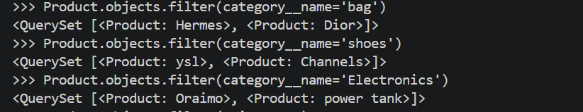
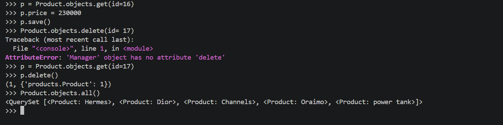
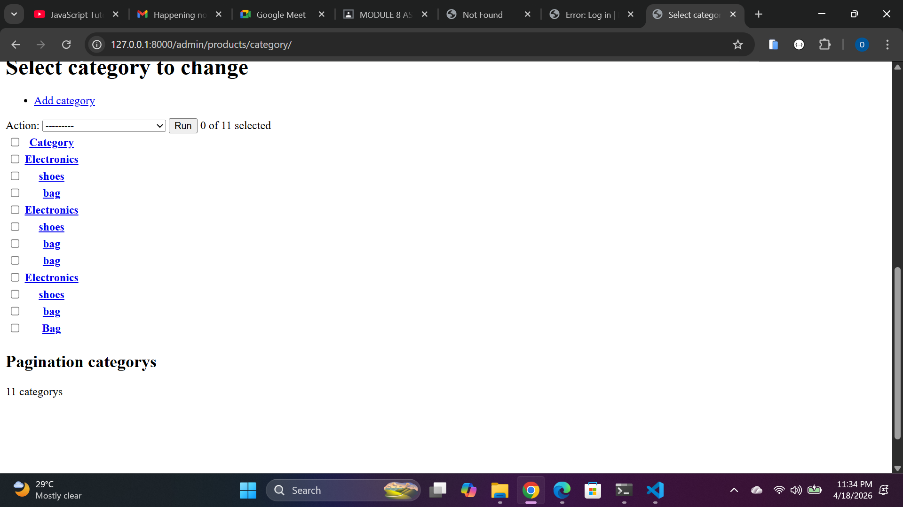

### README

## Project Description

### What is Toriloshop all about?
  Toriloshop project is all about a website that helps to make everday shopping easier and stressfree. it provide a seamless online shopping experience where users can shopacross a varity of product categories.

# Models
 Toriloshop currently has the followingmodels:

** Category - this model organise product into groups for easy browsing.
** Product - this model represent individual items available for purchase,linked to a category.

### Features Implemented
**Home View (`/`)**: Landing page for toriloshop.
- Product List View (`/products/`)**: Displays a catalog of available items.
- About View (`/about/`)**: Information regarding the store's history and mission.
- Custom 404 Error Page

### Category Model
name - the name of the category
description - the description of the item in the category

### Product Model
name - name of item
category - ForeignKey linking the product to a category
price - the price of the product
stock - the number of item in stock

# ORM Operations
deleted a single product using `p=Product.objects.get(id=x), p.delete()`
deleted all product using `Product.objects.all().delete()`
Retrieved all products using `Product.objects.all()`
Filtered products using `Product.objects.filter()`
Retrived a single product using`Product.objects.get()`

### Setup steps
* a virtual environment was created using - `python -m venv venv`
* activate the virtusl environment using - `venv/Scripts/activate`
* django was installed into the creted virtual environment using - `pip install django`
* The project toriloshop was created with the code - `django-admin startproject toriloshop`
* the apps products and users were created using -`python manage.py startapp products/python manage.py startapp users`
* to migrate - `python manage.py.makemigrations`
after this you migrate using -`python manage.py.migrate`
* to create a superuser `python manage.py createsuperuser`
* to run all that has has been done on the has been done in the apps with the code - `python manage.py runserver`
* 

#### Embedded screenshots using Markdown
all this are in the screenshot folder
# Project Screenshots

Home Page
   

Products Page

  

About

Project Structure 

 Product by Category

 All product
 

 Products with price > 5000
 

 updated price and a delected product
 

 Admin panel
 