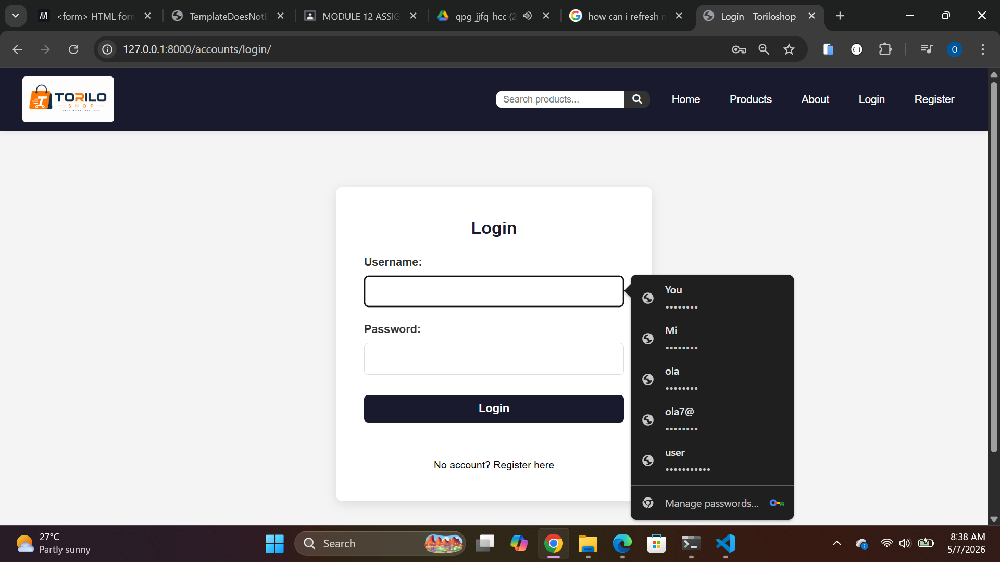
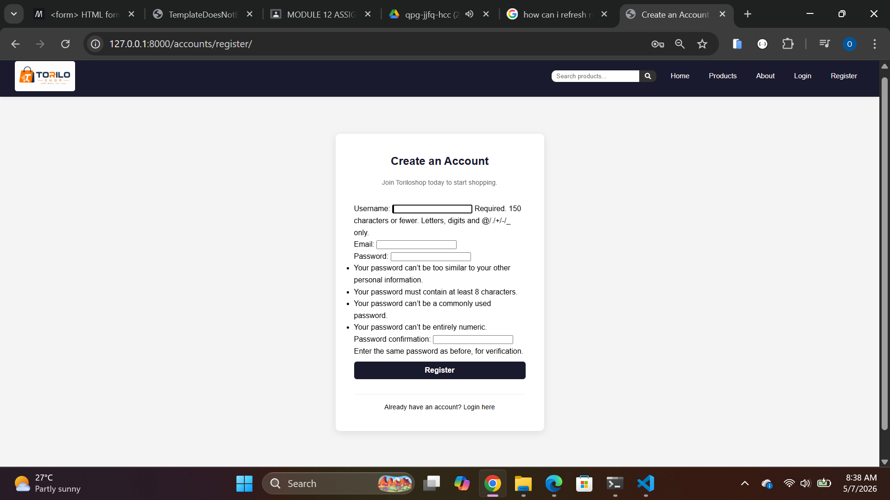
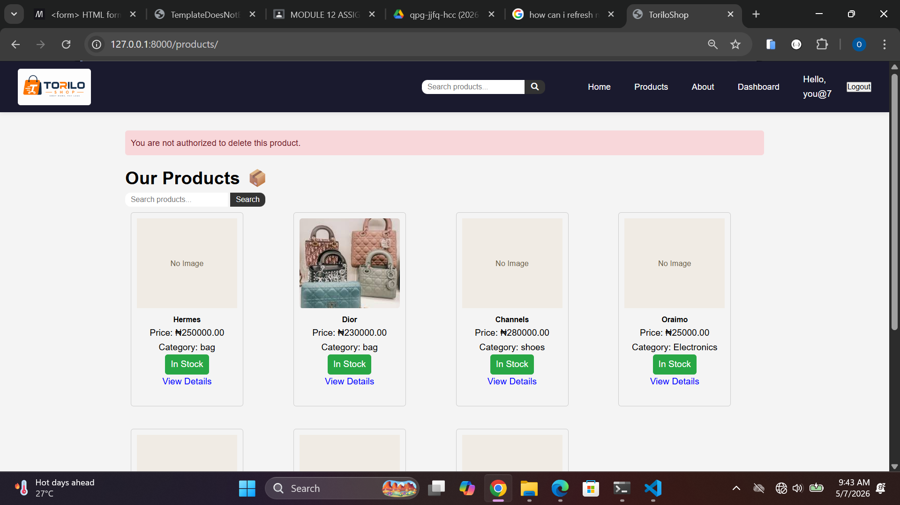
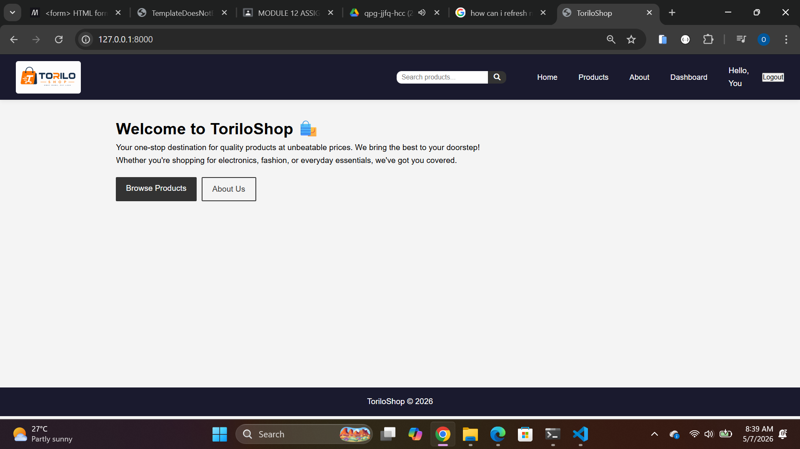

## ReadME

 # ToriloShop - Django Project
 
 ## Project Description
 TorilоShop is a Django-based e-commerce application. This update adds a complete user authentication system, including login, logout, registration, and route protection, along with dynamic navbar changes based on login state.
 
 ## Features Implemented
 
- User registration — new users can create an account via a signup form
- Login / logout — session-based authentication using Django's built-in auth system
- Protected routes — pages like product add and delete require the user to be logged in; non-staff users are blocked from destructive actions
- Staff-only delete — only users with is_staff = True can delete products; others receive a  messages.error("You are not authorized to delete this product.")

Navbar changes

- Logged-out users see Login and Register links
- Logged-in users see their username and a Logout link
- Staff users see additional Add Product and management links
 
 
 
 ## Setup Instructions
 
 1. Clone the repository:
    git clone https://github.com/olamide-15/olamide-alimi-backend-dune-cohort.git
 2. Navigate into the module-12 folder:
    cd-alimi-backend-dune-cohort/module-12
 3. Create a virtual environment:
    python -m venv venv
 4. Activate it:
    venv\Scripts\activate
 5. create a new app account and add to installed app in the project setttings.py
 6. create a new urls.py and forms.py and fill in it nececities
 7. create a new directory in your template named accounts 
 8. create three new file under template/accounts [login.html, register.html, dashboard.html]
 9. update product views and add restriction for who can delete products
 10. update the urls of the main project by including accounts to the url
 11. add Conditional content in base.html templates based on login state
 15. Run the server:
    python manage.py runserver
 16. Open browser at `http://127.0.0.1:8000/`
 
 ## Screenshots
 
 
 
 
 
 
 
 
 
 
 
 
 