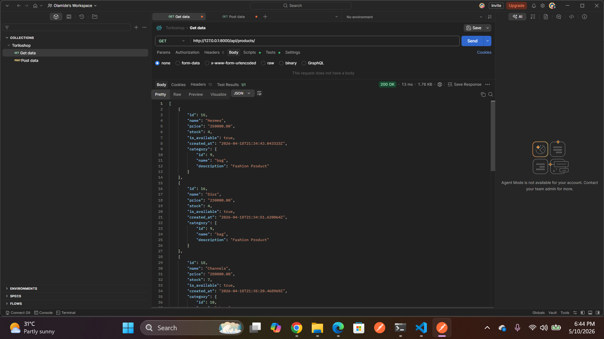
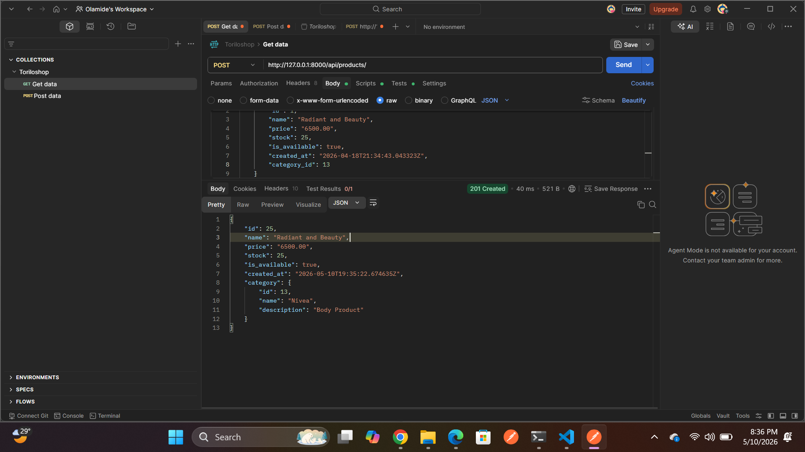
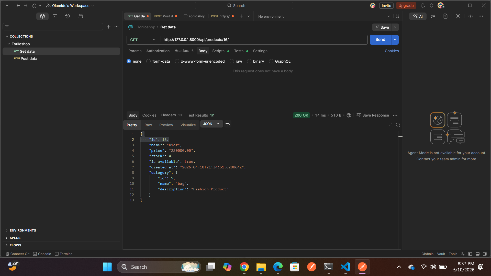
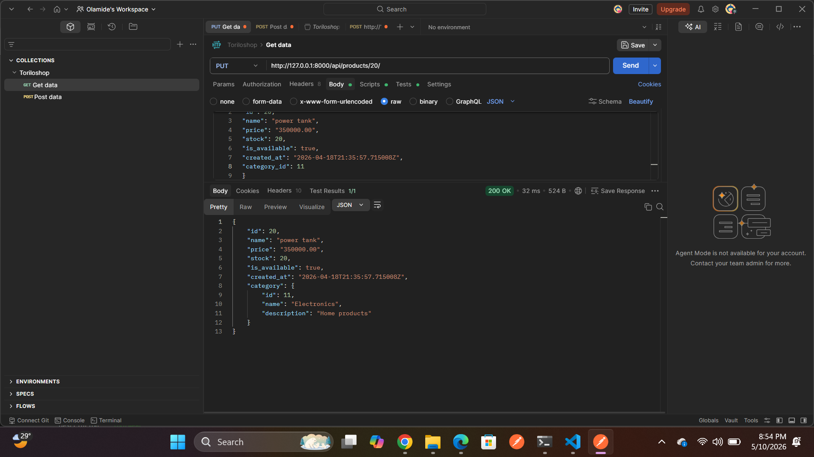
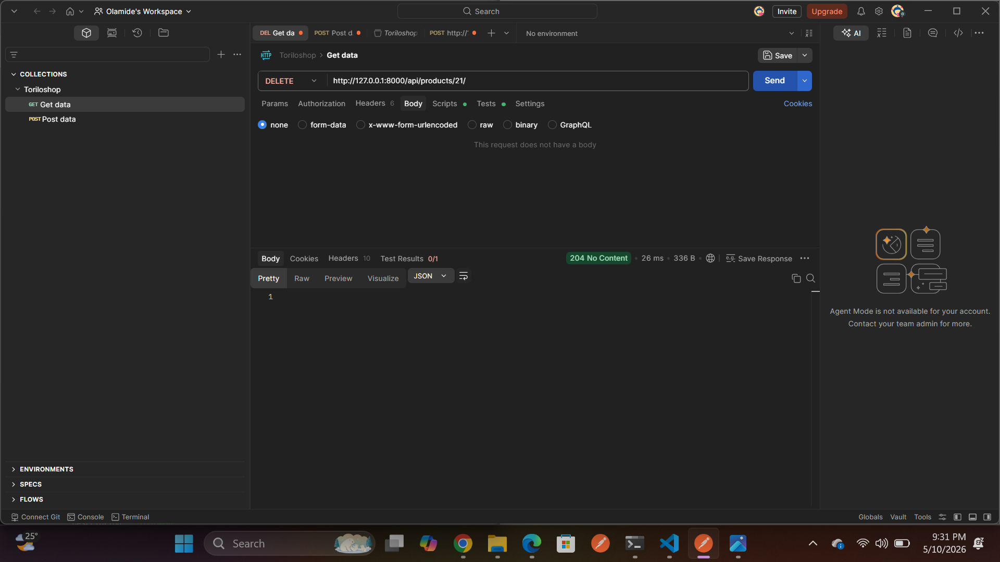
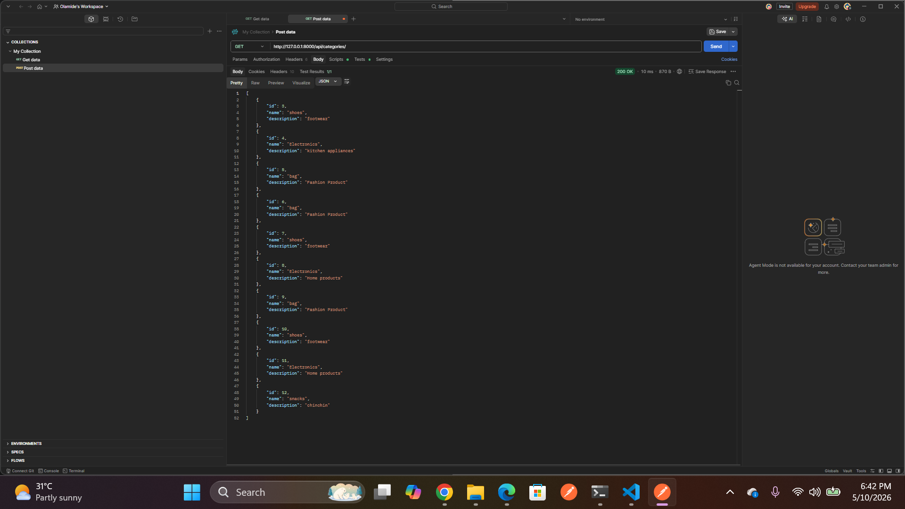

### Torioshop API
A Django REST Framework-powered e-commerce backend that exposes product and category management endpoints.

### Project Description
Torioshop is a RESTful API built with Django and Django REST Framework (DRF). It provides endpoints for managing products and categories in an e-commerce store, including creating, listing, updating, and deleting records.

### Features Implemented
- Retrieve a list of all products- /api/products/ - GET
- Create a new product - /api/products/ - POST
- Retrieve a single product by ID - /api/products/<id>/ - GET
- Fully update a product by ID - /api/products/<id>/ - PUT
- Partially update a product by ID - /api/products/<id>/ - PATCH
- Delete a product by ID - /api/products/<id>/ - DELETE
- Retrieve a list of all categories - /api/categories/ - GET
- Create a new category - /api/categories/ - POST

### setup instructions
- Clone the Repository https://github.com/olamide-15/olamide-alimi-backend-dune-cohort.git
- Create and Activate a Virtual Environment 
- Install Drf python -m pip install djangorestframework
-  Run the Development Server python manage.py runserver

### Testing with Postman

Open Postman
Click Import (top left)
Select the file: postman/torioshop.postman_collection.json

### Screenshots

