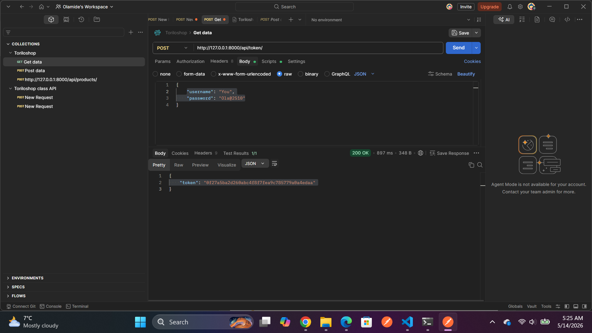
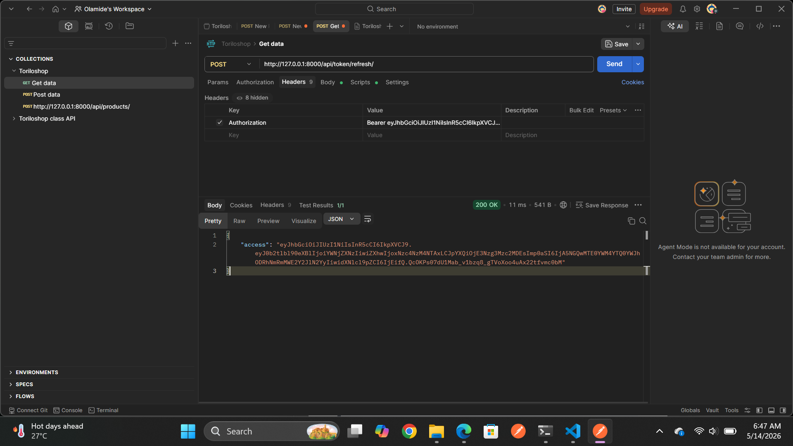
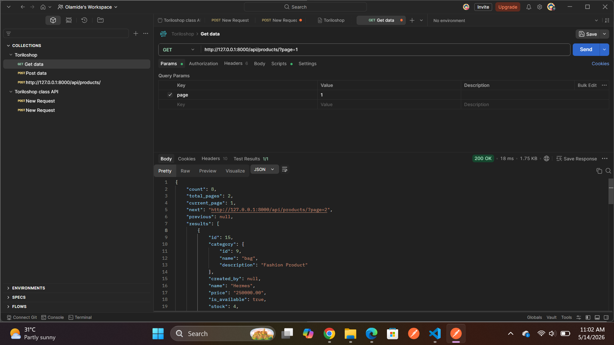
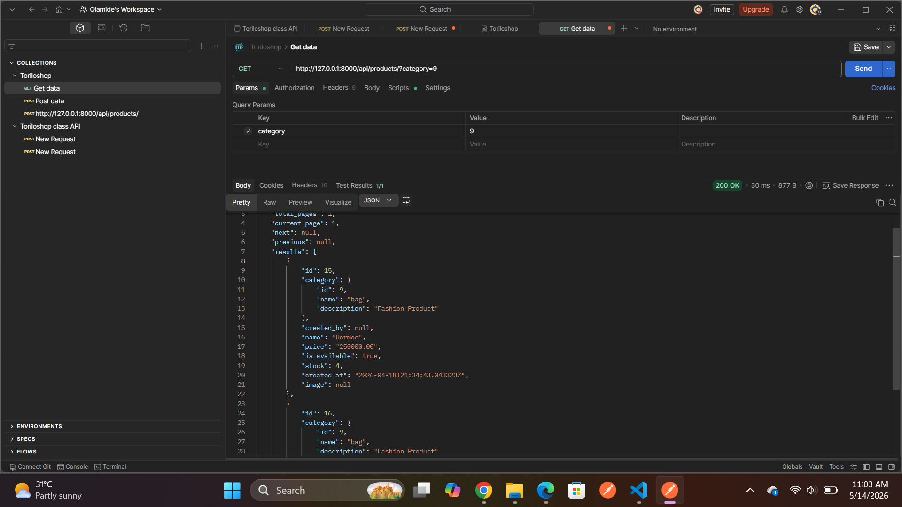

### Toriloshop API — Project Documentation
A Django REST Framework e-commerce backend with product and category management,
JWT authentication, token auth, CORS, pagination, filtering, search, and ordering

### Project Description
Toriloshop is a Django-based REST API that allows users to manage products and
categories in an online store. The project was extended with a full set of security
and API features to make it production-ready:

Authentication — users must obtain a token before accessing protected endpoints
Ownership control — only the creator of a product can edit or delete it
CORS — the API accepts requests from any frontend origin
Pagination — list endpoints return 6 items per page with navigation links
Filtering, search, and ordering — products can be filtered by category and
availability, searched by name, and ordered by price or date

# Features Implemented
1. Token Authentication (rest_framework.authtoken)
Django REST Framework's built-in token system. Each user gets a unique token stored
in the database. The client sends it in the Authorization header on every request.

2. JWT Authentication (rest_framework_simplejwt)
JSON Web Tokens — a stateless auth method. The client obtains an access token
(short-lived) and a refresh token (long-lived). No server-side session storage needed.

3. CORS (django-cors-headers)
Cross-Origin Resource Sharing headers allow any frontend (React, Vue, mobile app)
to call the API from a different domain or port.

4. 4. Pagination
All list endpoints return 6 products per page with a structured envelope:
### Testing with Postman

Open Postman
Click Import (top left)
Select the file: postman/torioshop.postman_collection.json

### Screenshots

